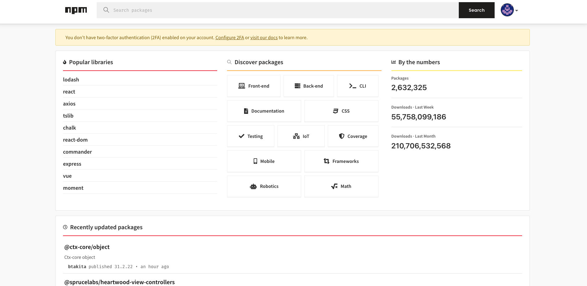

- [第三方库](#第三方库)
  - [NPM 或者 Yarn](#npm-或者-yarn)
    - [node-sass](#node-sass)
    - [CSS modules](#css-modules)
    - [axios](#axios)
    - [react-icons](#react-icons)
    - [moment](#moment)
    - [styled-components](#styled-components)
    - [reactstrap](#reactstrap)
    - [lodash](#lodash)
- [练习](#练习)
  - [练习1](#练习1)
  - [练习2](#练习2)

## 第三方库

npm 注册表上有超过 1.4M 个 JavaScript 包。到目前为止，几乎所有类型的问题都有一个包。我们不必创造轮子，而是必须知道如何使用轮子。在本节中，我们将学习如何使用 npm 包，并且还将为 React 应用程序实现最常见的包。

截至 2024 年 1 月 29 日，npm 注册表中的热门软件包、软件包总数、每周下载量和每月下载量如下所示。



大多数情况下，你的 React 应用程序中可能需要以下包。特别是node-sass、moment 和 axios 对于某些项目很重要。

  - node-sass
  - CSS modules
  - axios
  - react-icons
  - moment
  - styled-components
  - reactstrap
  - lodash

### NPM 或者 Yarn

您可以使用npm 或yarn 来安装软件包。如果你想使用yarn，你必须单独安装它。

```bash
npm i yarn -g
```

我们使用 npm 或者 yarn 初始化一个 package.json 文件，然后就可以安装上述的第三方库了。

1. 新建一个项目目录
2. 打开终端，并进入到该目录中执行以下操作：

```bash
npm init -y

# 或者
yarn init -y
```

#### node-sass

Sass 是一个 CSS 预处理器，允许编写 CSS 函数、嵌套等等。让我们安装node-sass来利用Sass的强大功能。

```bash
npm install node-sass

# 或者使用 yarn
yarn add node-sass
```

但是现在官方建议直接使用 `dart-scss`，也就是说我们直接安装 `sass` 就可以了，在 React 脚手架创建的项目中，默认已经配置了支持使用 Sass 的能力。现在只要安装 `sass` 即可。

```bash
npm install sass

# 或者使用 yarn
yarn add sass
```

安装好 `sass` 之后，我们可以开始在 `React` 中使用 `Sass`。比如我们现在有一个 `Header` 组件目录，在该目录中有一个 `Header.js` 文件和一个 `header.scss` 文件：

```css
header {
  background-color: #61dbfb;
  padding: 25;
  padding: 10px;
  margin: 0;
}
```

```js
import React from 'react'
import './header.scss'
const Header = () => (
  <header>
    <div className='header-wrapper'>
      <h1>30 Days Of React</h1>
      <h2>Getting Started React</h2>
      <h3>JavaScript Library</h3>
      <p>Instructor: Asabeneh Yetayeh</p>
      <small>Oct 15, 2020</small>
    </div>
  </header>
)

export default Header
```

```js
import React from 'react';
import ReactDOM from 'react-dom/client';
import Header from './Header/Header';

const root = ReactDOM.createRoot(document.getElementById('root'));
root.render(
  <React.StrictMode>
    <Header />
  </React.StrictMode>
);
```

#### CSS modules

除了 Sass 之外，我们也需要知道如何在项目中使用 CSS Module。

使用 CSS Module 不需要额外安装其他的包。 

CSS Module 可以与 Pure CSS 或 Sass 一起使用。 

CSS Module 的命名约定是特定名称后跟点和 module（如 `test.module.css` 或 `test.module.scss`）

命名规范为：`[name].module.scss` 或者 `[name].module.css`

```css
.header-wrapper {
  font-weight:500;
  border: 5px solid orange;
}
```

```js
import React from 'react'
import './header.scss'
import headerStyles from './header.module.css'
const Header = () => (
  <header>
    <div className={headerStyles['header-wrapper']}>
      <h1>30 Days Of React</h1>
      <h2>Getting Started React</h2>
      <h3>JavaScript Library</h3>
      <p>Instructor: Asabeneh Yetayeh</p>
      <small>Oct 15, 2020</small>
    </div>
  </header>
)

export default Header
```

#### axios

Axios 是一个 Ajax 库，可以发出 HTTP 请求来获取数据。在本节中，我们将看到 get 请求。不仅如此，还可以使用 axios 执行所有请求类型（GET、POST、PUT、PATCH、DELETE）。

```bash
npm install axios

# 使用 yarn
yarn add axios
```

```js
import React, { useCallback, useEffect, useMemo, useState } from 'react'
import axios from 'axios'

const Countries = () => {
  const [data, setData] = useState([])

  const fetchData = useCallback(() => {
    const API_URL = 'https://www.mxnzp.com/api/address/v2/list?app_id=rgihdrm0kslojqvm&app_secret=WnhrK251TWlUUThqaVFWbG5OeGQwdz09';

    axios
      .get(API_URL)
      .then((response) => {
        setData(response.data)
      })
      .catch(console.log)
  }, [])

  const renderCountries = useMemo(() => data.map((country) => {
    const languageOrLanguages =
      country.languages.length > 1 ? 'Languages' : 'Language'
    const formatLanguages = country.languages
      .map(({ name }) => name)
      .join(', ')
    return (
      <div>
        <div>
          {' '}
          {' '}
        </div>
        <div>
          <h1>{country.name}</h1>
          <p>Capital: {country.capital}</p>
          <p>
            {languageOrLanguages}: {formatLanguages}
          </p>
          <p>Population: {country.population}</p>
        </div>
      </div>
    )
  }), [data])

  useEffect(() => {
    fetchData()
  }, [fetchData])

  return (
    <div className='App'>
      <h1>Fetching Data Using Axios</h1>
      <div>
        <p>There are {data.length} countries in the api</p>
        <div className='countries-wrapper'>{renderCountries}</div>
      </div>
    </div>
  )
}

export default Countries
```

#### react-icons

图标是网站不可或缺的一部分。让我们来获取不同的 SVG 图标

```bash
npm install react-icons

# or use yarn
yarn add react-icons
```

```js
import React from 'react'
import {
  TiSocialLinkedinCircular,
  TiSocialGithubCircular,
  TiSocialTwitterCircular,
} from 'react-icons/ti'

const Footer = () => {
  return (
    <footer>
      <h3>30 Days Of React</h3>
      <div>
        <TiSocialLinkedinCircular />
        <TiSocialGithubCircular />
        <TiSocialTwitterCircular />
      </div>
      <div>
        <small> Copyright &copy; {new Date().getFullYear()} </small>
      </div>
    </footer>
  )
}

export default Footer
```

#### moment

Moment 是一个小型 JavaScript 库，它为我们提供了多种操作时间的 API。

```bash
npm install moment

# or use yarn
yarn add moment
```

```js
import React from 'react'
import moment from 'moment'

const Time = () => {
  return (
    <div className='App'>
      <h1>How to use moment</h1>
      <p>This challenge was started {moment('2020-10-01').fromNow()}</p>
      <p>The challenge will be over in {moment('2020-10-30').fromNow()}</p>
      <p>Today is {moment(new Date()).format('MMMM DD, YYYY HH:mm')}</p>
    </div>
  )
}

export default Time
```

#### styled-components

`styled-components` 可以使用模板字符串的方式来设置组件的样式。

它不再是组件和样式之间的一种映射关系，而是通过创建一个普通的 React 组件，这个组件里已经包含了我们定义的样式。

```js
import React from 'react'
import styled from 'styled-components'

const Title = styled.h1`
  font-size: 70px;
  font-weight: 300;
`

const Header = styled.header`
  background-color: #61dbfb;
  padding: 25;
  padding: 10px;
  margin: 0;
`

const StyledComponents = () => {
  return (
    <div className='App'>
      <Header>
        <div>
          <Title>30 Days Of React</Title>
          <h2>Getting Started React</h2>
          <h3>JavaScript Library</h3>
          <p>Instructor: Asabeneh Yetayeh</p>
          <small>Oct 15, 2020</small>
        </div>
      </Header>
    </div>
  )
}

export default StyledComponents
```

#### reactstrap

Reactstrap 包允许使用带有 bootstrap 的组件。

```bash
npm install reactstrap

# or use yarn
yarn add reactstrap
```

如果我们不想再安装 `bootstrap`，可以直接在模板页面中引入 `bootstrap` 的样式

```html
<head>
  <link
    rel="stylesheet"
    href="https://cdn.jsdelivr.net/npm/bootstrap@5.1.0/dist/css/bootstrap.min.css"
  />
</head>
```

然后在组件中使用 reactstrap：

```js
import React from 'react';
import { Button } from 'reactstrap';

export default (props) => {
  return <Button color="danger">Danger!</Button>;
};
```

#### lodash

根据 lodash 官方文档，“一个提供模块化、性能和附加功能的现代 JavaScript 实用程序库。”

```bash
npm install lodash

# or use yarn
yarn add lodash
```

还有一些比较有趣的第三方依赖包，大家可以到 npm 的官网查看。

## 练习

### 练习1

1. 什么是包？

> 包（Package）是一种用于组织和分发代码、资源和依赖项的结构。它可以包含可执行文件、库、模块、配置文件等，并且通常以特定的格式（如 npm 中的 package.json）进行描述和管理。

2. 什么是第三方包？

> 第三方包（Third-party package）是由独立的开发者或组织创建并维护的包，它们不属于你所编写的项目。这些包可以通过包管理工具（如 npm）进行安装和使用，以提供特定的功能、库或工具。

3. 必须使用第三方包吗？

> 不一定必须使用第三方包。有些功能可以自己实现，但使用现有的第三方包可以节省时间和精力，同时还可以利用其他开发者共享的经验和最佳实践。这样可以加快开发速度并提高代码的可靠性。

4. 如何知道第三方软件包的受欢迎程度和稳定性？

> - 在 npm 上查看包的下载量和星级评价：通常包的下载量和社区中对其的反馈可以反映其受欢迎程度。
> - 了解包的维护情况：查看包的最近更新时间、开发者活跃度以及对问题和请求的响应速度。
> - 阅读文档和示例：包的文档和示例可以帮助我们了解其功能和使用方式。
> - 查看社区支持和讨论：查看包是否有活跃的社区支持和讨论，这可以帮助我们解决问题和获取更多信息。

5. npm 注册表中有多少个 JavaScript 包？

> 这个每一年甚至每一天都在变化，所以自己上 npm 上去看吧

6. 如何安装第三方包？

> 两种方法：
> - 在项目的根目录下运行命令 "npm install <package-name>" 或者 "yarn add <package-name>" 即可安装指定的包
> - 还可以通过在 package.json 文件中的 dependencies 或 devDependencies 字段中添加包名称，并运行 "npm install" 或者 "yarn" 来一次性安装所有依赖项

7. 您最常使用哪些软件包？

> axios vue react lodash moment

8. 你用什么包来获取数据？

> axios

9.  classnames 包的目的是什么？

> classnames 包是一个常用的 JavaScript 实用工具，用于动态生成 CSS 类名。它可以根据条件来切换不同的类名，使得在 React 或其他框架中动态设置组件的样式变得更加方便和灵活

10. validator 包是什么？

> validator 包是一个用于验证和处理数据的 JavaScript 库。它提供了一系列函数，可以用于验证字符串、数字、日期等各种类型的数据。validator 可以用于检查表单输入、数据有效性以及执行各种数据验证任务

### 练习2

1. 了解如何使用 Sass
2. 了解如何使用 axios
3. 了解如何使用 moment 和 react-icons
4. 使用 validator 验证您在第 12 天获得的表单
5. 使用 classnames 更改类名。
