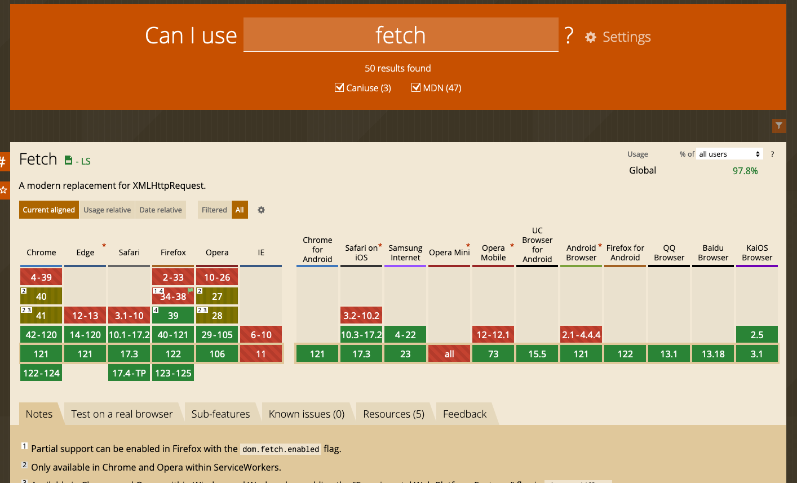

- [Fetch 和 Axios](#fetch-和-axios)
  - [Fetch](#fetch)
  - [Axios](#axios)
- [练习](#练习)
  - [练习1](#练习1)
  - [练习2](#练习2)
  - [练习3](#练习3)

## Fetch 和 Axios

### Fetch

目前，JavaScript 提供了 fetch API 来发出 HTTP 请求。现在基本所有浏览器都支持 fetch。但是，目前开发中，大多数项目还是用的 axios 来进行 API 请求。

关于各大浏览器对于 fetch 的支持情况，我们可以在 [caniuse](https://caniuse.com/?search=fetch) 上进行搜索查看：



可以看到 PC 浏览器基本都支持，除了 IE，不过 IE 已经被淘汰了。而在手机端 除了 Opera 之外，其他浏览器的支持度也都OK，总得支持度已经达到了 97.8%。

接下来让我们看一个例子：

```js
import React, { useState, useEffect } from 'react'
import ReactDOM from 'react-dom'

const Country = ({
  country: { name, capital, flag, languages, population, currency },
}) => {
  const formatedCapital =
    capital.length > 0 ? (
      <>
        <span>Capital: </span>
        {capital}
      </>
    ) : (
      ''
    )
  const formatLanguage = languages.length > 1 ? `Languages` : `Language`
  console.log(languages)
  return (
    <div className='country'>
      <div className='country_flag'>
        
      </div>
      <h3 className='country_name'>{name.toUpperCase()}</h3>
      <div class='country_text'>
        <p>{formatedCapital}</p>
        <p>
          <span>{formatLanguage}: </span>
          {languages.map((language) => language.name).join(', ')}
        </p>
        <p>
          <span>Population: </span>
          {population.toLocaleString()}
        </p>
        <p>
          <span>Currency: </span>
          {currency}
        </p>
      </div>
    </div>
  )
}

function App() {
  const [data, setData] = useState([])

  const fetchCountryData = async () => {
    const url = 'https://restcountries.eu/rest/v2/all'
    try {
      const response = await fetch(url)
      const res = await response.json()
      setData(res)
    } catch(error) {}
  }

  useEffect(() => {
    fetchCountryData()
  }, [])

  return (
    <div className='App'>
      <h1>Fetching API using Fetch</h1>
      <h1>Calling API</h1>
      <div>
        <p>There are {data.length} countries in the api</p>
        <div className='countries-wrapper'>
          {data.map((country) => (
            <Country country={country} />
          ))}
        </div>
      </div>
    </div>
  )
}

const rootElement = document.getElementById('root')
ReactDOM.render(<App />, rootElement)
```
接下来，让我们看看如何使用 axios 执行相同的 API 调用。

### Axios

因为 axios 是第三方库，我们需要使用 npm 去安装它。它支持 GET\POST\PUT\PATCH\DELETE 请求，在本节实例中，我们将仅举例 GET 请求。

```js
import React, { useState, useEffect } from 'react'
import ReactDOM from 'react-dom'
import axios from 'axios'

const Country = ({ country: { name, flag, population } }) => {
  return (
    <div className='country'>
      <div className='country_flag'>
        
      </div>
      <h3 className='country_name'>{name.toUpperCase()}</h3>
      <div class='country_text'>
        <p>
          <span>Population: </span>
          {population}
        </p>
      </div>
    </div>
  )
}

function App() {
  const [data, setData] = useState([])

  const fetchCountryData = async () => {
    const url = 'https://restcountries.eu/rest/v2/all'
    try {
      const response = await axios.get(url)
      setData(response.data)
    } catch(error) {}
  }

  useEffect(() => {
    fetchCountryData()
  }, [])

  return (
    <div className='App'>
      <h1>React Component Life Cycle</h1>
      <h1>Calling API</h1>
      <div>
        <p>There are {data.length} countries in the api</p>
        <div className='countries-wrapper'>
          {data.map((country) => (
            <Country country={country} />
          ))}
        </div>
      </div>
    </div>
  )
}

const rootElement = document.getElementById('root')
ReactDOM.render(<App />, rootElement)
```

可以看到，fetch 和 axios 之间没有太大区别。但建议多使用 axios 而不是 fetch，因为所有浏览器都支持且易于使用。

## 练习

### 练习1

### 练习2

### 练习3
