# 配置 React 的运行环境

- [前期准备](#前期准备)
  
  - [Node](#node)
  
  - [Module](#module)
  
  - [Package](#package)
  
  - [Node Package Manager(NPM)](#node-package-managernpm)
  
  - [Visual Studio Code](#visual-studio-code)
  
  - [Browser](#browser)
  
  - [Visual Studio Extensions](#visual-studio-extensions)
  
  - [Create React App](#create-react-app)

- [创建你的第一个 React App](#创建你的第一个-react-app)
  
  - [React 项目模板](#react-项目模板)
  
  - [JSX 中的样式](#jsx-中的样式)
  
  - [在 JSX 元素中加入数据](#在-jsx-元素中加入数据)
  
  - [在 React 中导入一个媒体对象](#在-react-中导入一个媒体对象)

- [练习](#练习)

### 前期准备

在上一节中，我们了解了 JSX，并使用 CDN 的方式访问了 React 和 ReactDOM 包。但是，在实际项目中，我们需要使用 `create-react-app` 包来创建项目而不是使用 CDN 来进行开发。

最初的 create-react-app 是在 2016 年 7 月 22 日发布。在此之前，开发人员通常要手动配置 Webpack，这里面会包含 babel 和所有必要的一些插件，比如 loader 和压缩插件等等，而配置这些通常都是比较耗费时间的。

但自从 CRA（以下都会使用 CRA 来代替 create-react-app）出现之后，我们可以使用它提供的命令快速创建项目，生成的项目中已经内置了开发和生产的 Webpack 配置，这样我们就可以不再关心这些东西而直接上手进行业务开发了。

那在开始之前我们还需要学习一下在使用 React 时都需要的一些工具及环境。

#### Node

Node 是一个 JS 的运行环境，允许 JS 在服务器上运行。Node 创建于 2009 年。

CRA 创建的项目在启动时，会在本地启动一个 Node 服务器，端口号为 3000，在浏览器输入 `localhost:3000` 进行访问。

如果你还未拥有 Node，可以到 [Node 的官网](https://nodejs.org/en/)进行安装。


一般选择安装 LTS 版本也就是稳定版本的。

安装好 Node 之后，我们可以打开终端来检查一下是否安装成功：

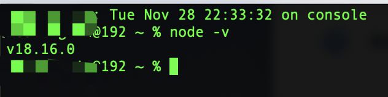

#### Module

一个项目中可以包含一个或者多个函数，这些函数可以在需要时导出和导入。比如现在有一个 `math.js` 文件：

```js
// math.js
export const addTwo = (a, b) => a + b
export const multiply = (a, b) => a * b
export const subtract = (a, b) => a - b

export default (function doSomeMath() {
  return {
    addTwo,
    multiply,
    subtract,
  }
})()
```

然后我们可以将 `math.js` 文件导入到另一个文件中：

```js
// index.js
// to import the doSomeMath from the math.js with or without extension
import doSomeMath from './math.js'

// to import the other modules
// since these modules were not exported as default we have to desctructure
import { addTwo, multiply, subtract } from './math.js'

import * as everything from './math.js' // to import everything remaining
console.log(addTwo(5, 5))
console.log(doSomeMath.addTwo(5, 5))
console.log(everything)
```

在后面，我们可以看到 `import React from 'react'` 等导入 React 库的代码。

#### Package

包是一个模块或模块的集合。比如，React、ReactDOM 都是包。

#### Node Package Manager(NPM)

npm 是 Node 中内置的模块，它是 Node.js 里的默认包管理器。用于在 Node.js 应用程序中安装、更新和卸载依赖包。通过 npm，可以很方便地查找和安装来自 npm 仓库中的各个模块，也可以将自己开发的模块发布到 npm 仓库供他人使用。

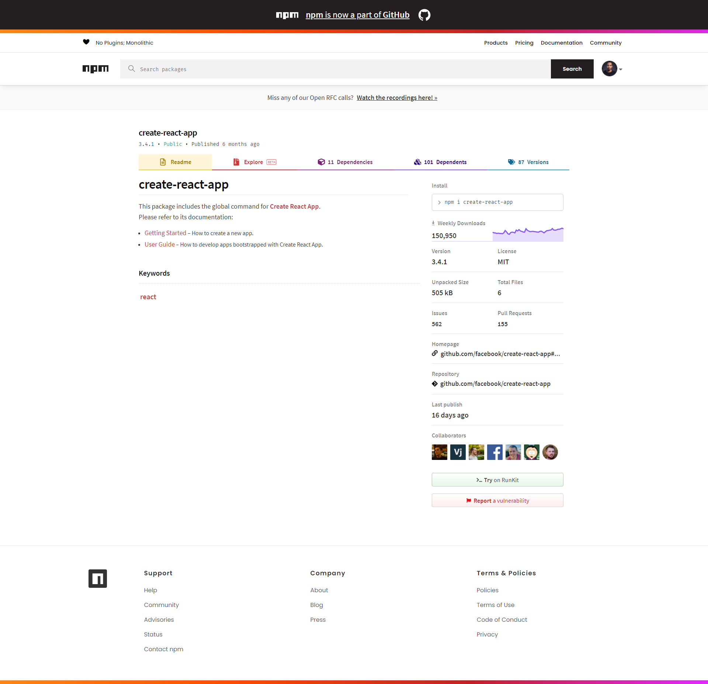

#### Visual Studio Code

我们一般使用 VSCode 作为代码编辑器，安装地址在这里👉[Download](https://code.visualstudio.com/)

#### Browser

一般使用 Google 的 Chrome 浏览器。

#### Visual Studio Extensions

在 VSCode 上安装一些有助于提高开发效率的插件：

- Prettier

- ESLint

- Bracket Pair Colorizer

- ES7 React/Redux/GraphQL/React-Native snippets

#### Create React App

我们可以使用 CRA 在电脑终端上输入以下命令来快速创建 React 项目：

```bash
npx create-react-app <name-of-your-project>
```

然后 CRA 就开始为我们创建 React 项目，它会安装项目必须的依赖，并生成对应的项目目录。

### 创建你的第一个 React App

```bash
$ cd Desktop
$ npx create-react-app 30-days-of-react
$ cd 30-days-of-react/
$ npm start
```

现在你的第一个 React 程序已经在 `localhost:3000` 上开始运行了。

在生成的项目中，我们可以看到根组件 `App.jsx` ，在这个文件上面可以修改或者增加一些内容，然后浏览器端可以看到最新的更改。

如果想要停止服务器，可以在终端按下 `Ctrl + C`。

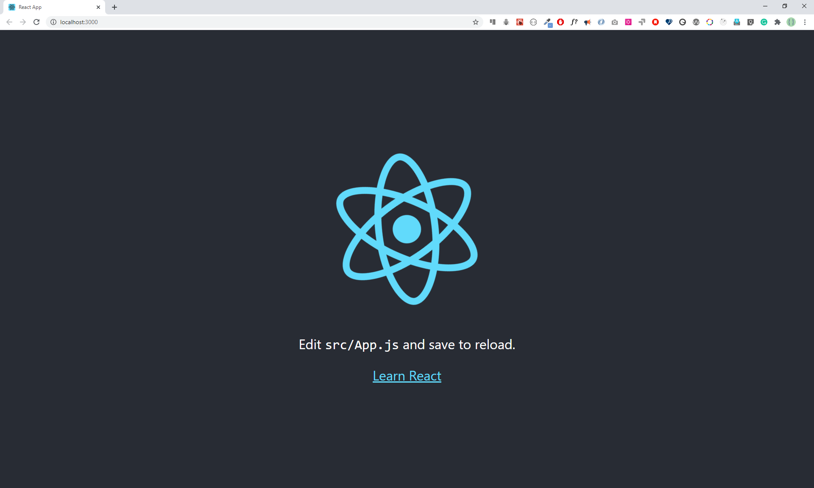

#### React 项目模板

让我们来看看由 CRA 创建的 React 模板。当我们每次创建新项目时，都需要运行 `npx create-react-app` 和项目名称。

> ⚠️注意：在 CRA 的[官网](https://create-react-app.xiniushu.com/getting-started)中建议将全局的 CRA 卸载掉，这样可以确保 `npx` 总是会使用最新版本的 CRA。
> 
> 所以如果还是在使用全局的 `create-react-app <your_app_name>` 会报错，提示信息中指出不再支持 Create React App 的全局安装

在生成的项目模板中，有三个目录：

- src：
  
  - App.css,index.css - 前者是 App.js 组件的样式，后者是项目的通用样式
  
  - index.js - 入口文件，它是用来连接 index.html 和 React 组件的桥梁
  
  - App.js - React 项目中的根组件
  
  - reportWebVitals.js：这个文件用于报告 Web 基准指标数据，其中 Web Vitals 是一组用于衡量网站用户体验的指标，包括页面加载时间和交互性能等；
  
  - setupTest.js：这个文件用于配置测试环境，在其中可以进行一些全局的测试设置，比如引入测试所需要的库、进行测试环境的初始化等。在这个文件中，可以配置 Enzyme、Jest 和 Mocha 等测试框架的设置，以便在运行测试时能够正确地进行初始化和清理工作。
  
  - App.test.js：这是 App.js 文件对应的测试文件。在其中可以编写针对 App 组件的单元测试和集成测试，用于确保该组件在不同情况下的行为符合预期。

- public：这是存放项目静态资源的目录，它里面有：
  
  - index.html - 项目中的 HTML 模板，不管是开发还是打包，HTML 都是以它为准的；
  
  - favicon.ico：自带的图标文件，也就是 react 的图标
  
  - manifest.json：用于描述 PWA 的清单文件。PWA（Progressive Web App）是一种使用现代 Web 技术构建的应用程序，可以像原生应用一样运行在用户的设备上，具有离线访问和推送通知等功能。
  
  - 一些静态图片
  
  - robots.txt：用于指示网络爬虫在抓取网站内容时应该遵守的规则。也就是说，通过该文件，网站管理员可以告诉搜索引擎爬虫哪些页面可以被抓取，哪些页面不可以被抓取，以及其他抓取行为的限制和指导。这对于网站的 SEO 至关重要。

- node_modules：项目中安装的依赖包都会在这个目录中

此外还有一些其他文件：

- .gitignore：这个文件里的内容（主要是文件和文件夹路径）不会被推送到仓库

- README.md：项目介绍，使用 Markdown 语法

- package.json：它记录了项目的元数据、依赖关系和脚本等信息。在使用 npm 或者 yarn 等包管理器时，这个文件用于指定项目所需要的依赖、开发依赖以及一些自定义脚本命令等。

- yarn.lock（或者 package-lock.json）：这个文件里的内容是用来锁定包版本的

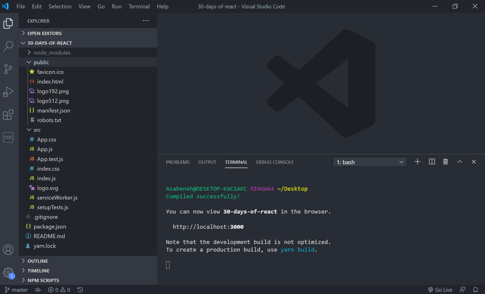

接下来我们需要删除一些目前用不到的文件，只保留需要的文件。

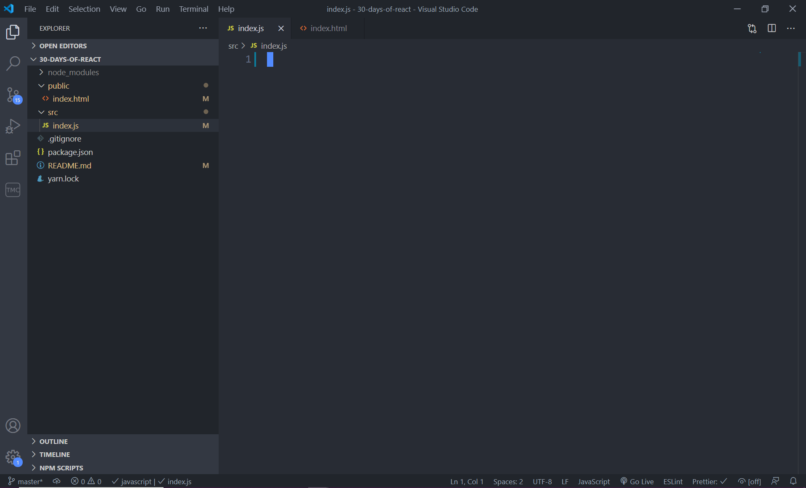

在 index.js 中我们导入 `React` 和 `ReactDOM`。

React 允许我们编写 JSX 和 ReactDOM 在 DOM 上渲染 JSX。ReactDOM 有一个 render 方法，使用它可以将 React 元素渲染到指定的 DOM 中。它有两个参数：

- 要渲染的 JSX 元素

- 被挂载的 DOM

```js
//index.js
// importing the react and react-dom package

import React from 'react'
import ReactDOM from 'react-dom'

const jsxElement = <h1>This is a JSX element</h1>
const rootElement = document.getElementById('root')

ReactDOM.render(jsxElement, rootElement)
```

```html
<!-- index.html -->
<!DOCTYPE html>
<html lang="en">
  <head>
    <meta charset="utf-8" />
    <meta name="viewport" content="width=device-width, initial-scale=1" />
    <link
      href="https://fonts.googleapis.com/css?family=Montserrat:300,400,500|Roboto:300,400,500&display=swap"
      rel="stylesheet"
    />
    <meta
      name="description"
      content="Web site created using create-react-app"
    />

    <title>30 Days Of React App</title>
  </head>
  <body>
    <div id="root"></div>
  </body>
</html>
```

然后我们打开终端并进入到该目录，执行 `npm start` 命令来启动项目，最终在浏览器上会看到：

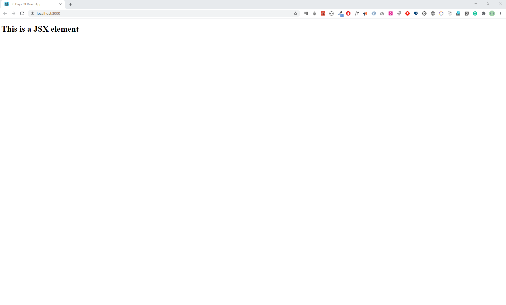

接下来让我们编写更多的 JSX 元素到里面：

```js
//index.js
// importing the react and react-dom package

import React from 'react'
import ReactDOM from 'react-dom'

const header = (
  <header>
    <h1>Welcome to 30 Days Of React</h1>
    <h2>Getting Started React</h2>
    <h3>JavaScript Library</h3>
    <p>Asabeneh Yetayeh</p>
    <small>Oct 2, 2020</small>
  </header>
)
const rootElement = document.getElementById('root')

ReactDOM.render(header, rootElement)
```

页面会变成这样：

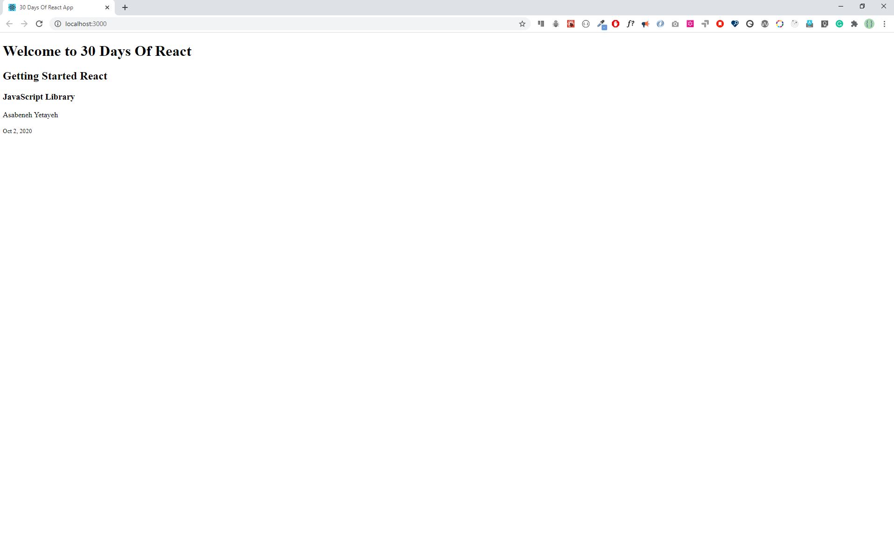

看着是不是也有些单调，那我们把之前所有的 JSX 元素都加进来：

```js
//index.js
// importing the react and react-dom package
import React from 'react'
import ReactDOM from 'react-dom'

// JSX element, header
const header = (
  <header>
    <h1>Welcome to 30 Days Of React</h1>
    <h2>Getting Started React</h2>
    <h3>JavaScript Library</h3>
    <p>Asabeneh Yetayeh</p>
    <small>Oct 2, 2020</small>
  </header>
)

// JSX element, main
const main = (
  <main>
    <p>Prerequisite to get started react.js:</p>
    <ul>
      <li>HTML</li>
      <li>CSS</li>
      <li>JavaScript</li>
    </ul>
  </main>
)

// JSX element, footer
const footer = (
  <footer>
    <p>Copyright 2020</p>
  </footer>
)

// JSX element, app, a container or a parent
const app = (
  <div>
    {header}
    {main}
    {footer}
  </div>
)

const rootElement = document.getElementById('root')
// we render the JSX element using the ReactDOM package
// ReactDOM has the render method and the render method takes two argument
ReactDOM.render(app, rootElement)
// or
//  ReactDOM.render([header, main, footer], rootElement)
```

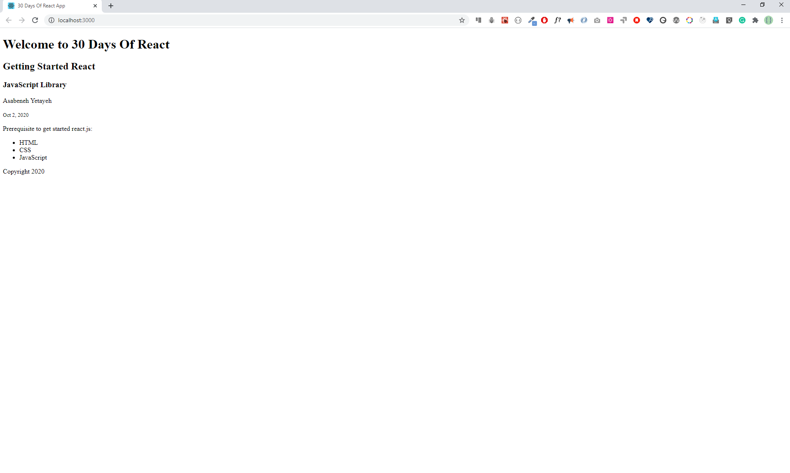

#### JSX 中的样式

让我们使用内联的方式给 JSX 中增加一些样式进去。

```js
// index.js
import React from 'react'
import ReactDOM from 'react-dom'

const headerStyles = {
  backgroundColor: '#61DBFB',
  fontFamily: 'Helvetica Neue',
  padding: 25,
  lineHeight: 1.5,
}

// JSX element, header
const header = (
  <header style={headerStyles}>
    <div className='header-wrapper'>
      <h1>Welcome to 30 Days Of React</h1>
      <h2>Getting Started React</h2>
      <h3>JavaScript Library</h3>
      <p>Asabeneh Yetayeh</p>
      <small>Oct 2, 2020</small>
    </div>
  </header>
)

// JSX element, main
const mainStyles = {
  backgroundColor: '#F3F0F5',
}
const main = (
  <main style={mainStyles}>
    <p>Prerequisite to get started react.js:</p>
    <ul>
      <li>HTML</li>
      <li>CSS</li>
      <li>JavaScript</li>
    </ul>
  </main>
)

const footerStyles = {
  backgroundColor: '#61DBFB',
}
// JSX element, footer
const footer = (
  <footer style={footerStyles}>
    <p>Copyright 2020</p>
  </footer>
)

// JSX element, app
const app = (
  <div className='app'>
    {header}
    {main}
    {footer}
  </div>
)

const rootElement = document.getElementById('root')
// we render the JSX element using the ReactDOM package
ReactDOM.render(app, rootElement)
```

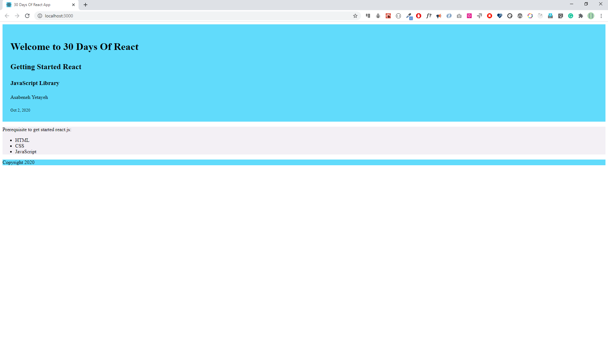

我们再来尝试使用内部的方式来改变 JSX 元素的样式，内部样式我们是直接加到了 index.html 中：

```js
// index.js
import React from 'react'
import ReactDOM from 'react-dom'
// JSX element, header
const header = (
  <header>
    <div className='header-wrapper'>
      <h1>Welcome to 30 Days Of React</h1>
      <h2>Getting Started React</h2>
      <h3>JavaScript Library</h3>
      <p>Instructor: Asabeneh Yetayeh</p>
      <small>Date: Oct 1, 2020</small>
    </div>
  </header>
)

// JSX element, main
const main = (
  <main>
    <div className='main-wrapper'>
      <p>
        Prerequisite to get started{' '}
        <strong>
          <em>react.js</em>
        </strong>
        :
      </p>
      <ul>
        <li>HTML</li>
        <li>CSS</li>
        <li> JavaScript</li>
      </ul>
    </div>
  </main>
)

// JSX element, footer
const footer = (
  <footer>
    <div className='footer-wrapper'>
      <p>Copyright 2020</p>
    </div>
  </footer>
)

// JSX element, app
const app = (
  <div className='app'>
    {header}
    {main}
    {footer}
  </div>
)

const rootElement = document.getElementById('root')
// we render the JSX element using the ReactDOM package
ReactDOM.render(app, rootElement)
```

```html
<!DOCTYPE html>
<html lang="en">
  <head>
    <meta charset="utf-8" />
    <meta name="viewport" content="width=device-width, initial-scale=1" />
    <link
      href="https://fonts.googleapis.com/css?family=Montserrat:300,400,500|Roboto:300,400,500&display=swap"
      rel="stylesheet"
    />
    <meta
      name="description"
      content="Web site created using create-react-app"
    />

    <title>30 Days Of React App</title>
    <style>
      /* == General style === */
      * {
        box-sizing: border-box;
        padding: 0;
        margin: 0;
      }

      html,
      body {
        height: 100%;
        line-height: 1.5;
        font-family: 'Montserrat';
        font-weight: 300;
        color: black;
      }

      .root {
        min-height: 100%;
        position: relative;
      }

      .header-wrapper,
      .main-wrapper,
      .footer-wrapper {
        width: 85%;
        margin: auto;
      }

      .header-wrapper,
      .main-wrapper {
        padding: 10px;
        margin: 2px auto;
      }

      h1 {
        font-size: 70px;
        font-weight: 300;
      }

      h2,
      h3 {
        font-weight: 300;
      }

      header {
        background-color: #61dbfb;
        padding: 10px;
      }

      main {
        padding: 10px 10px 60px;
        /* Height of the footer */
      }

      ul {
        margin-left: 15px;
      }

      ul li {
        list-style: none;
      }

      footer {
        position: absolute;
        bottom: 0;
        width: 100%;
        height: 60px;
        /* Height of the footer */
        background: #6cf;
      }

      .footer-wrapper {
        font-weight: 400;
        text-align: center;
        line-height: 60px;
      }
    </style>
  </head>
  <body>
    <div id="root"></div>
  </body>
</html>
```

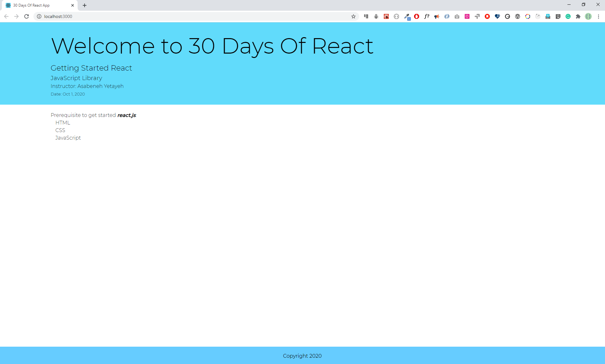

#### 在 JSX 元素中加入数据

```js
// index.js
import React from 'react'
import ReactDOM from 'react-dom'
// To get the root element from the HTML document

// JSX element, header
const welcome = 'Welcome to 30 Days Of React'
const title = 'Getting Started React'
const subtitle = 'JavaScript Library'
const author = {
  firstName: 'Asabeneh',
  lastName: 'Yetayeh',
}
const date = 'Oct 2, 2020'

// JSX element, header
const header = (
  <header>
    <div className='header-wrapper'>
      <h1>{welcome}</h1>
      <h2>{title}</h2>
      <h3>{subtitle}</h3>
      <p>
        Instructor: {author.firstName} {author.lastName}
      </p>
      <small>Date: {date}</small>
    </div>
  </header>
)

const numOne = 3
const numTwo = 2

const result = (
  <p>
    {numOne} + {numTwo} = {numOne + numTwo}
  </p>
)

const yearBorn = 1820
const currentYear = new Date().getFullYear()
const age = currentYear - yearBorn
const personAge = (
  <p>
    {' '}
    {author.firstName} {author.lastName} is {age} years old
  </p>
)

// JSX element, main
const techs = ['HTML', 'CSS', 'JavaScript']
const techsFormatted = techs.map((tech) => <li>{tech}</li>)

// JSX element, main
const main = (
  <main>
    <div className='main-wrapper'>
      <p>
        Prerequisite to get started{' '}
        <strong>
          <em>react.js</em>
        </strong>
        :
      </p>
      <ul>{techsFormatted}</ul>
      {result}
      {personAge}
    </div>
  </main>
)

const copyRight = 'Copyright 2020'

// JSX element, footer
const footer = (
  <footer>
    <div className='footer-wrapper'>
      <p>{copyRight}</p>
    </div>
  </footer>
)

// JSX element, app
const app = (
  <div className='app'>
    {header}
    {main}
    {footer}
  </div>
)

const rootElement = document.getElementById('root')
// we render the JSX element using the ReactDOM package
ReactDOM.render(app, rootElement)
```

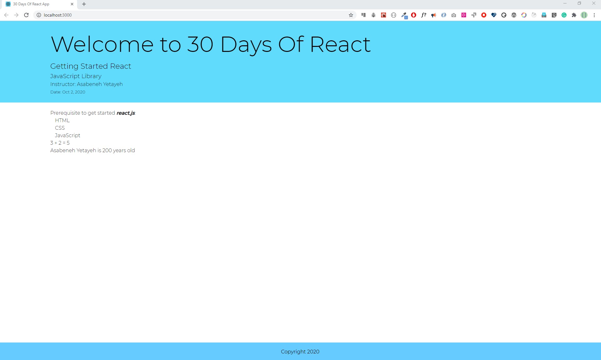

#### 在 React 中导入一个媒体对象

那我们在 React 中如何导入图片、视频和音频呢？

首先我们来看看如何导入图像。

在 src 文件夹中创建 images 文件夹并在其中保存图像，例如我们将保存 day3_demo.jpg  图像并将该图像导入到 index.js 中。

导入后，我们将其注入 JSX 表达式 user 中。

```js
// index.js
import React from 'react'
import ReactDOM from 'react-dom'
import day3Demo from './images/day3_demo.jpg'

const user = (
  <div>
    
  </div>
)

const rootElement = document.getElementById('root')
// we render the JSX element using the ReactDOM package
ReactDOM.render(user, rootElement)
```


让我们完善一下页面内容：

```js
// index.js
import React from 'react'
import ReactDOM from 'react-dom'
// To get the root element from the HTML document
import day3Demo from './images/day3_demo.jpg'
// JSX element, header
const welcome = 'Welcome to 30 Days Of React'
const title = 'Getting Started React'
const subtitle = 'JavaScript Library'
const author = {
  firstName: 'Asabeneh',
  lastName: 'Yetayeh',
}
const date = 'Oct 2, 2020'

// JSX element, header
const header = (
  <header>
    <div className='header-wrapper'>
      <h1>{welcome}</h1>
      <h2>{title}</h2>
      <h3>{subtitle}</h3>
      <p>
        Instructor: {author.firstName} {author.lastName}
      </p>
      <small>Date: {date}</small>
    </div>
  </header>
)

const numOne = 3
const numTwo = 2

const result = (
  <p>
    {numOne} + {numTwo} = {numOne + numTwo}
  </p>
)

const yearBorn = 1820
const currentYear = new Date().getFullYear()
const age = currentYear - yearBorn
const personAge = (
  <p>
    {' '}
    {author.firstName} {author.lastName} is {age} years old
  </p>
)

// JSX element, main
const techs = ['HTML', 'CSS', 'JavaScript']
const techsFormatted = techs.map((tech) => <li>{tech}</li>)

const user = (
  <div>
    
  </div>
)

// JSX element, main
const main = (
  <main>
    <div className='main-wrapper'>
      <p>
        Prerequisite to get started{' '}
        <strong>
          <em>react.js</em>
        </strong>
        :
      </p>
      <ul>{techsFormatted}</ul>
      {result}
      {personAge}
      {user}
    </div>
  </main>
)

const copyRight = 'Copyright 2020'

// JSX element, footer
const footer = (
  <footer>
    <div className='footer-wrapper'>
      <p>{copyRight}</p>
    </div>
  </footer>
)

// JSX element, app
const app = (
  <div className='app'>
    {header}
    {main}
    {footer}
  </div>
)

const rootElement = document.getElementById('root')
// we render the JSX element using the ReactDOM package
ReactDOM.render(app, rootElement)
```

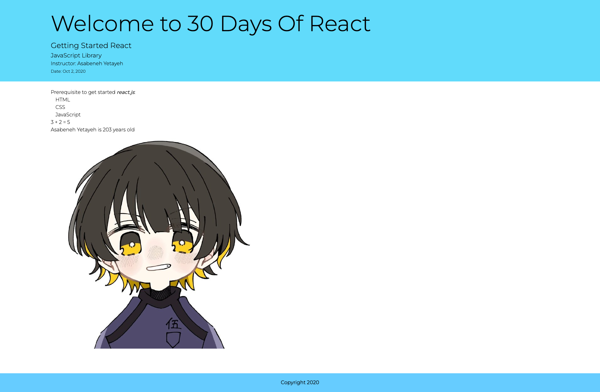

> 源码看同级目录的 demo 文件夹哦
