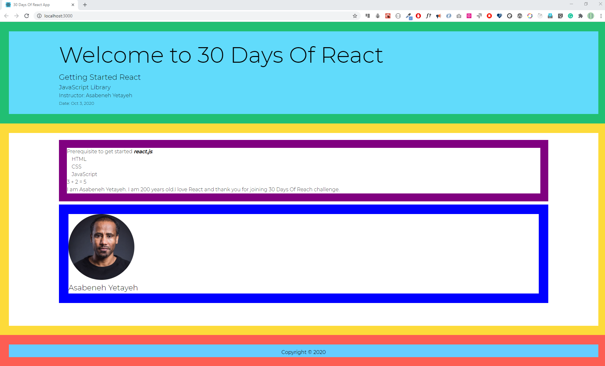
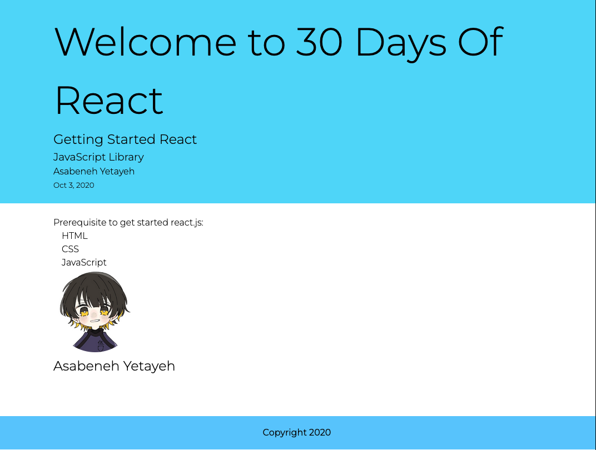
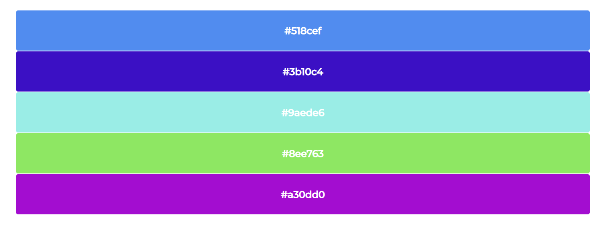

# Components

- [划分组件](#划分组件)

- [JavaScript 函数](#javascript-函数)

- [JavaScript 类](#javascript-类)

- [创建 React 组件](#创建-react-组件)
  
  - [函数组件](#函数组件)
  
  - [类组件](#类组件)
  
  - [在 React 组件中使用动态数据](#在-react-组件中使用)
  
  - [进一步了解函数组件](#进一步了解函数组件)

- [练习](#练习)
  
  - [练习1](#练习1)
  
  - [练习2](#练习2)
  
  - [练习3](#练习3)

什么是 React 组件？

React 组件是一段可重用的代码，通过组件之间的组合就构成了一个个完整的模块，一个个完整的模块又构成了一个完整的应用程序。所以说 React 应用程序是组件的聚合。

在下面的示例中展示了不同的组件，我们给不同的组件给了不同的边框颜色。

我们可以使用 JS 函数或者类来创建组件，如果使用 JS 函数，则该组件就是函数式组件，而如果使用类，那么该组件就是类组件。在 React 16.8 以后的版本中已经很少使用类组件了，大多数情况下我们都使用函数式组件。

组件的类型有：

- 函数组件

- 展示组件

- 无状态组件

- 有状态组件

- 容器组件

- 哑组件

- 类组件

- 智能组件

React 组件是返回 JSX 的 JavaScript 函数或者类。组件名必须以大写字母开头，如果名称是两个单词，则应该是有两个驼峰的形式——CamelCase.

## 划分组件

在上一节，我们在网页中使用 buttons, forms, texts, media objects, header, section, article 和 footer等元素构建了一个简单的页面。

如果我们有一个需要被经常使用的 button 按钮，我们可以创建一个按钮组件，而不是在需要的时候重新创建它。对于其他元素也是如此。

在下图中，页面、页面主体和页脚都是组件，而在主体内部还有一个用户卡组件和一个文本部分组件。图中共有五个组件，不同的颜色代表不同的组件。



在正式进入到 React 组件学习之前，我们先来回顾一下函数和类。

## JavaScript 函数

JavaScript 函数可以是常规函数也可以是箭头函数。它俩之间存在着细微的差别。

```js
const getUserInfo = (firstName, lastName, country, title, skills) => {
  return `${firstName} ${lastName},  a ${title} developer based in ${country}. He knows ${skills.join(
    ' '
  )} `
}
// When we call this function we need parameters
const skills = ['HTML', 'CSS', 'JS', 'React']
console.log(
  getUserInfo('Asabeneh', 'Yetayeh', 'Finland', 'FullStack Developer', skills)
)
```

## JavaScript 类

类是一个对象的抽象。我们通过实例化一个类来创建具有共性的不同的对象。此外我们可以通过继承父级的所有方法和属性来创建子级。

```js
class Parent {
  constructor(firstName, lastName, country, title) {
    // we bind the params with this class object using this keyword
    this.firstName = firstName
    this.lastName = lastName
    this.country = country
    this.title = title
  }
  getPersonInfo() {
    return `${this.firstName} ${this.lastName},  a ${this.title} developer base in ${this.country} `
  }
  parentMethod() {
    // code goes here
  }
}

const p1 = new Parent('Asabeneh', 'Yetayeh', 'Finland', 'FullStack Developer')

class Child extends Parent {
  constructor(firstName, lastName, country, title, skills) {
    super(firstName, lastName, country, title)
    this.skills = skills
    // we bind the child params with the this keyword to this child object
  }
  getSkills() {
    let len = this.skills.length
    return len > 0 ? this.skills.join(' ') : 'No skills found'
  }
  childMethod() {
    // code goes here
  }
}

const skills = ['HTML', 'CSS', 'JS', 'React']

const child = new Child(
  'Asabeneh',
  'Yetayeh',
  'Finland',
  'FullStack Developer',
  skills
)
```

这里我们只是简单的回顾一下，因为 React 组件是由 JavaScript 函数或者类构成的，所以现在让我们制作一个 React 组件。

## 创建 React 组件

### 函数组件

使用 JS 中的函数，可以创建一个函数组件。

```jsx
// React component syntax
// it can be arrow function, function declaration or function expression
const jsx = <tag> Content </tag>
const ComponentName = () => {
  return jsx
}

// JSX element, header
const header = (
  <header style={headerStyles}>
    <div className='header-wrapper'>
      <h1>Welcome to 30 Days Of React</h1>
      <h2>Getting Started React</h2>
      <h3>JavaScript Library</h3>
      <p>Asabeneh Yetayeh</p>
      <small>Oct 3, 2020</small>
    </div>
  </header>
)

// React Component
const Header = () => {
  return header
}

// or we can just return the JSX

const Header = () => {
  return (
    <header style={headerStyles}>
      <div className='header-wrapper'>
        <h1>Welcome to 30 Days Of React</h1>
        <h2>Getting Started React</h2>
        <h3>JavaScript Library</h3>
        <p>Asabeneh Yetayeh</p>
        <small>Oct 3, 2020</small>
      </div>
    </header>
  )
}

// Even th above code can be written like this
// Explicitly returning the JSX
const Header = () => (
  <header style={headerStyles}>
    <div className='header-wrapper'>
      <h1>Welcome to 30 Days Of React</h1>
      <h2>Getting Started React</h2>
      <h3>JavaScript Library</h3>
      <p>Asabeneh Yetayeh</p>
      <small>Oct 3, 2020</small>
    </div>
  </header>
)
```

### 组件渲染

现在让我们将所有的 JSX 元素都更改为组件。当我们使用组件时，可以按照 HTML 元素的方式，将组件名称包裹在尖括号中。

组件中可以接受一些来自外界的状态，这些状态我们称为 props。

```jsx
// index.js
import React from 'react'
import ReactDOM from 'react-dom'

// Header Component
const Header = () => (
  <header>
    <div className='header-wrapper'>
      <h1>Welcome to 30 Days Of React</h1>
      <h2>Getting Started React</h2>
      <h3>JavaScript Library</h3>
      <p>Asabeneh Yetayeh</p>
      <small>Oct 3, 2020</small>
    </div>
  </header>
)

const rootElement = document.getElementById('root')
// we render the JSX element using the ReactDOM package
ReactDOM.render(<Header />, rootElement)
```

接下来我们使用函数组件的形式来创建一个完整的页面：

```jsx
// index.js
import React from 'react'
import ReactDOM from 'react-dom'
import asabenehImage from './images/asabeneh.jpg'

// Header Component
const Header = () => (
  <header>
    <div className='header-wrapper'>
      <h1>Welcome to 30 Days Of React</h1>
      <h2>Getting Started React</h2>
      <h3>JavaScript Library</h3>
      <p>Asabeneh Yetayeh</p>
      <small>Oct 3, 2020</small>
    </div>
  </header>
)

// User Card Component
const UserCard = () => (
  <div className='user-card'>
    
    <h2>Asabeneh Yetayeh</h2>
  </div>
)

// TechList Component
const TechList = () => {
  const techs = ['HTML', 'CSS', 'JavaScript']
  const techsFormatted = techs.map((tech) => <li key={tech}>{tech}</li>)
  return techsFormatted
}

// Main Component
const Main = () => (
  <main>
    <div className='main-wrapper'>
      <p>Prerequisite to get started react.js:</p>
      <ul>
        <TechList />
      </ul>
      <UserCard />
    </div>
  </main>
)

// Footer Component
const Footer = () => (
  <footer>
    <div className='footer-wrapper'>
      <p>Copyright 2020</p>
    </div>
  </footer>
)

// The App, or the parent or the container component
const App = () => (
  <div className='app'>
    <Header />
    <Main />
    <Footer />
  </div>
)

const rootElement = document.getElementById('root')
// we render the App component using the ReactDOM package
ReactDOM.render(<App />, rootElement)
```



### 在 React 组件中使用动态数据

到目前为止，我们一直都是在写静态页面，没有使用过任何的动态数据在里面。现在让我们将不同的数据类型作为动态数据传递。

动态数据可以是字符串、数字、布尔值、数组或者对象。在 React 组件中，如果要使用动态数据需要使用 {} 来进行包裹。

```jsx
import React from 'react'
import ReactDOM from 'react-dom'

const welcome = 'Welcome to 30 Days Of React'
const title = 'Getting Started React'
const subtitle = 'JavaScript Library'
const firstName = 'Asabeneh'
const lastName = 'Yetayeh'
const date = 'Oct 3, 2020'

// JSX element, header
const Header = () => {
  return (
    <header>
      <div className='header-wrapper'>
        <h1>{welcome}</h1>
        <h2>{title}</h2>
        <h3>{subtitle}</h3>
        <p>
          Instructor: {firstName} {lastName}
        </p>
        <small>Date: {date}</small>
      </div>
    </header>
  )
}
const rootElement = document.getElementById('root')
// we render the App component using the ReactDOM package
ReactDOM.render(<Header />, rootElement)
```

### 进一步了解函数组件

最小的组件是什么样的？

类似按钮组件或者输入框组件，即只返回单个 HTML 的组件被视为小组件，这些组件通常会作为一些基础组件在项目中被使用。

```jsx
const Button = () => <button>action</button>
```

Button 组件由单个 HTML 按钮元素组成。让我们使用 JavaScript 样式对象来设置此按钮的样式。所有 CSS 属性都应该采用驼峰命名法来创建 JavaScript CSS 对象。

如果我们传递一个没有单位的数字作为 CSS 值，它的单位默认是 px。

```jsx
const buttonStyles = {
  padding: '10px 20px',
  background: 'rgb(0, 255, 0',
  border: 'none',
  borderRadius: 5,
}
const Button = () => <button style={buttonStyles}> action </button>
```

Button 组件是一个哑组件，因为它不带任何参数，我们无法动态更改里面的内容。我们将在下一节给组件添加一些状态，以便外界可以动态改变组件。

接下来我们创建一个展示随机 16 进制数的组件。

```jsx
import React from 'react'
import ReactDOM from 'react-dom'

// Hexadecimal color generator
const hexaColor = () => {
  let str = '0123456789abcdef'
  let color = ''
  for (let i = 0; i < 6; i++) {
    let index = Math.floor(Math.random() * str.length)
    color += str[index]
  }
  return '#' + color
}

const HexaColor = () => <div>{hexaColor()}</div>

const rootElement = document.getElementById('root')
// we render the App component using the ReactDOM package
ReactDOM.render(<HexaColor />, rootElement)
```

## 练习

### 练习1

1. 常规函数和箭头函数有什么区别？

2. 什么是 React 组件？

3. 如何创建 React 函数组件？

4. 纯 JavaScript 函数和函数式组件有什么区别？

5. React 组件有多小？

6. 创建一个按钮或输入字段组件

7. 制作一个可重用的 Button 组件。

8. 制作一个可重用的InputField 组件

9. 制作一个可重用的警告框组件，其中包含一个 div 父元素和一个 div 的 p 子元素（警告警告框、成功警告框）

### 练习2

和上一节的练习2一样，不过这次需要使用函数组件来完成

### 练习3

1. 使用文章中的十六进制数生成器来创建一些随机颜色



2.使用函数组件来完成上一节中最后的练习
