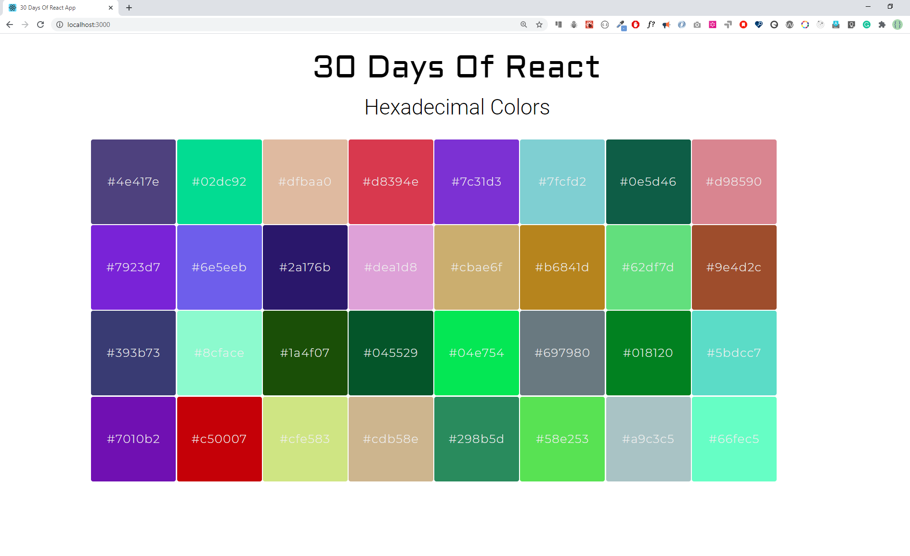

- 映射数组
  
  - 映射和渲染数组

- 练习
  
  - 练习1
  
  - 练习2
  
  - 练习3

### 映射数组

数组是最常用的数据结构，用于处理多种问题。在 React 中，我们使用 map 将数组修改为 JSX 列表，方法是使用 HTML 元素来包裹数组中的每个元素。

#### 映射和渲染数组

大多数时候数据都是数组或者对象数组的形式。为了渲染这个数组或者对象数组，我们需要使用 map 来实现渲染。

让我们来几个例子：

- 如果我们直接将数组渲染到页面上会是什么样子？

```js
import React from 'react'
import ReactDOM from 'react-dom'
const App = () => {
  return (
    <div className='container'>
      <div>
        <h1>Numbers List</h1>
        {[1, 2, 3, 4, 5]}
      </div>
    </div>
  )
}

const rootElement = document.getElementById('root')
ReactDOM.render(<App />, rootElement)
```

打开浏览器之后我们会发现，这些数字连在一起了。为了避免这种情况，我们要使用 map 将这个数组转换为 JSX 元素。如下代码所示：

```js
import React from 'react'
import ReactDOM from 'react-dom'

const Numbers = ({ numbers }) => {
  // modifying array to array of li JSX
  const list = numbers.map((number) => <li>{number}</li>)
  return list
}

// App component

const App = () => {
  const numbers = [1, 2, 3, 4, 5]

  return (
    <div className='container'>
      <div>
        <h1>Numbers List</h1>
        <ul>
          <Numbers numbers={numbers} />
        </ul>
      </div>
    </div>
  )
}

const rootElement = document.getElementById('root')
ReactDOM.render(<App />, rootElement)
```

- 如何渲染二维数组呢？来看一个例子

```js
import React from 'react'
import ReactDOM from 'react-dom'

const skills = [
  ['HTML', 10],
  ['CSS', 7],
  ['JavaScript', 9],
  ['React', 8],
]

// Skill Component
const Skill = ({ skill: [tech, level] }) => (
  <li>
    {tech} {level}
  </li>
)

// Skills Component
const Skills = ({ skills }) => {
  const skillsList = skills.map((skill) => <Skill skill={skill} />)
  console.log(skillsList)
  return <ul>{skillsList}</ul>
}

const App = () => {
  return (
    <div className='container'>
      <div>
        <h1>Skills Level</h1>
        <Skills skills={skills} />
      </div>
    </div>
  )
}

const rootElement = document.getElementById('root')
ReactDOM.render(<App />, rootElement)
```

在这个例子中我们有一个子组件 Skills，它会先循环二维数组 skills，然后里面会使用另外一个子组件。Skill，从而得到一组 Skill 组件，并将其赋值给 skillsList，最终将 skillsList 包裹在 ul 标签中。

而在这个。Skill 组件中，会对二维数组中的每一项数组都进行解构赋值，再将值渲染到 li 标签中，最终将完整的一组 li 返回出去给外界使用。

这里只是简单举例了一下对于二维数组要怎么在 React 组件中进行渲染，实际情况可能比这复杂的多。

- 对于数组对象形式的数据结构，要怎么进行渲染

数组对象的渲染，相对较其他基本数据类型组成的数组，实际上只是对数组中的每一项的值的使用有所不同，因为是对象形式，所以我们在渲染时，必然是使用 `object.[key]` 的形式来读取值，而不像基本数据类型那样直接进行访问。

```js
import React from 'react'
import ReactDOM from 'react-dom'

const countries = [
  { name: 'Finland', city: 'Helsinki' },
  { name: 'Sweden', city: 'Stockholm' },
  { name: 'Denmark', city: 'Copenhagen' },
  { name: 'Norway', city: 'Oslo' },
  { name: 'Iceland', city: 'Reykjavík' },
]

// Country component
const Country = ({ country: { name, city } }) => {
  return (
    <div>
      <h1>{name}</h1>
      <small>{city}</small>
    </div>
  )
}

// countries component
const Countries = ({ countries }) => {
  const countryList = countries.map((country) => <Country country={country} />)
  return <div>{countryList}</div>
}
// App component
const App = () => (
  <div className='container'>
    <div>
      <h1>Countries List</h1>
      <Countries countries={countries} />
    </div>
  </div>
)

const rootElement = document.getElementById('root')
ReactDOM.render(<App />, rootElement)
```

#### 循环渲染中的 key

key 帮助 React 识别已更改、添加或删除的元素。我们需要在循环渲染时，给循环体里的每一个 JSX 元素都添加 key 属性，以便给元素提供稳定的标识。

key 应该是唯一的，在给其赋值时需要注意。

如果我们在循环渲染期间，不给循环体内的元素添加 key 属性，React 会在浏览器上抛出警告。

```js
import React from 'react'
import ReactDOM from 'react-dom'

const Numbers = ({ numbers }) => {
  // modifying array to array of li JSX
  const list = numbers.map((num) => <li key={num}>{num}</li>)
  return list
}

const App = () => {
  const numbers = [1, 2, 3, 4, 5]

  return (
    <div className='container'>
      <div>
        <h1>Numbers List</h1>
        <ul>
          <Numbers numbers={numbers} />
        </ul>
      </div>
    </div>
  )
}

const rootElement = document.getElementById('root')
ReactDOM.render(<App />, rootElement)
```

如果是数组对象，我们需要将其中肯定不会重复的属性作为 key 传递给组件元素，如果都会有重复，那么就需要在开发中想办法解决（比如在循环之前对数组做一次处理，增加一个 id 属性，每一项的 id 属性都是唯一的）。

```js
import React from 'react'
import ReactDOM from 'react-dom'

const countries = [
  { name: 'Finland', city: 'Helsinki' },
  { name: 'Sweden', city: 'Stockholm' },
  { name: 'Denmark', city: 'Copenhagen' },
  { name: 'Norway', city: 'Oslo' },
  { name: 'Iceland', city: 'Reykjavík' },
]

// Country component
const Country = ({ country: { name, city } }) => {
  return (
    <div>
      <h1>{name}</h1>
      <small>{city}</small>
    </div>
  )
}

// countries component
const Countries = ({ countries }) => {
  const countryList = countries.map((country) => (
    <Country key={country.name} country={country} />
  ))
  return <div>{countryList}</div>
}
const App = () => (
  <div className='container'>
    <div>
      <h1>Countries List</h1>
      <Countries countries={countries} />
    </div>
  </div>
)

const rootElement = document.getElementById('root')
ReactDOM.render(<App />, rootElement)
```

### 练习

#### 练习1

1. 为什么需要映射数组？

2. 为什么我们在映射数组时需要键？

3. 解构代码的重要性是什么？

4. 解构是否能让你的代码变得干净且易于阅读？

#### 练习2

- 创建一个 React 组件，在组件中渲染32个方块，每个方块都有不同的颜色，要求按照偶数为绿色，奇数为黄色，素数为红色


- 创建一个 React 组件，要求随机生成 32 个不同颜色的方块



#### 练习3

- 使用给定的数据制作下面的横向柱状图

```js
export const tenHighestPopulation = [
  { country: 'World', population: 7693165599 },
  { country: 'China', population: 1377422166 },
  { country: 'India', population: 1295210000 },
  { country: 'United States of America', population: 323947000 },
  { country: 'Indonesia', population: 258705000 },
  { country: 'Brazil', population: 206135893 },
  { country: 'Pakistan', population: 194125062 },
  { country: 'Nigeria', population: 186988000 },
  { country: 'Bangladesh', population: 161006790 },
  { country: 'Russian Federation', population: 146599183 },
  { country: 'Japan', population: 126960000 },
]
```


🎉 CONGRATULATIONS ! 🎉
